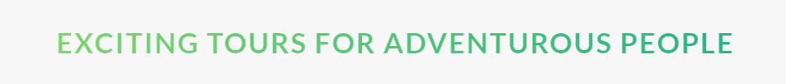
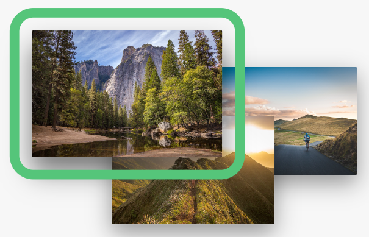

# [Natours Project - Responsive Layout](https://soliamarko.github.io/natours-project/ "Natours Project - Responsive Layout")

`Live:` https://soliamarko.github.io/natours-project/

The layout for this app is made within the Udemy course: "Advanced CSS and Sass: Flexbox, Grid, Animations and More!", Jonas Schmedtmann.

A Natours landing page with cute animations. Completed with HTML & CSS (SASS).

## Features

- Fully **responsive**
- **HTML** and **SASS**
- **7-1 SASS pattern** & **BEM**
- animations with **@keyframes**
- **utility classes**

### Overview

---

Designed by Jonas Schmedtmann, implemented by me.

[to be continued 😄]

## How To . . .

- make **gradient-colored text**?



```
background-image: linear-gradient(
  to right,
  variables.$color-primary-light,
  variables.$color-primary-dark
);
-webkit-background-clip: text;
color: transparent
```

---

- add **space between element and border** (outline)?

<p align="center" width="100%">
     
</p>

```
outline: 3rem solid green;       // setting border
outline-offset: 2rem;            // adding space*
```

## Glossary

> **Utility Classes** - classes, that have **1 single goal**

## Used Tools

- _[Google Fonts](https://fonts.google.com/)_
- _[Linea](https://linea.io/)_
